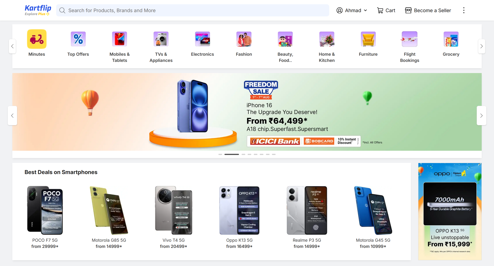
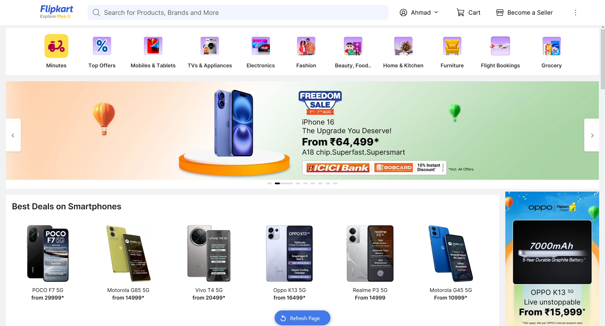

# KartFlip — A Flipkart Clone Project 

KartFlip is a demo project that is loosely a clone of Flipkart, built for demonstration purposes.

KartFlip showcases a simplified e-commerce platform that replicates Flipkart's core features and design patterns.

## 📸 Clone vs Original

Below is a visual comparison between KartFlip and the original Flipkart homepage:

### KartFlip (Clone)

### Flipkart (Original)

---

*These screenshots demonstrate how KartFlip replicates the look and feel of Flipkart's homepage. While inspired by the original design, all code and assets are developed from scratch for educational purposes.*

## 📄 License

**Copyright © 2025 SomeAB**

> ⚠️ **For demonstration purposes only**

- No permission is granted to copy, modify, distribute, or use this software
- All code, files, and assets are protected under copyright
- **Project commenced:** July 31st, 2025

*All rights reserved.* 
